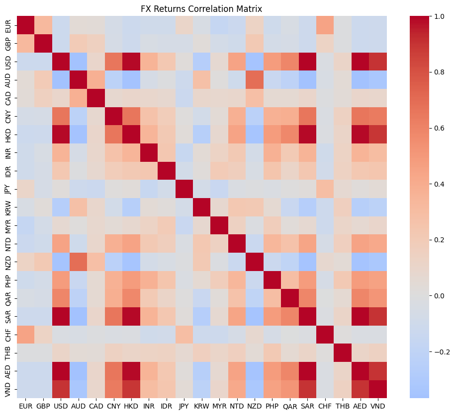
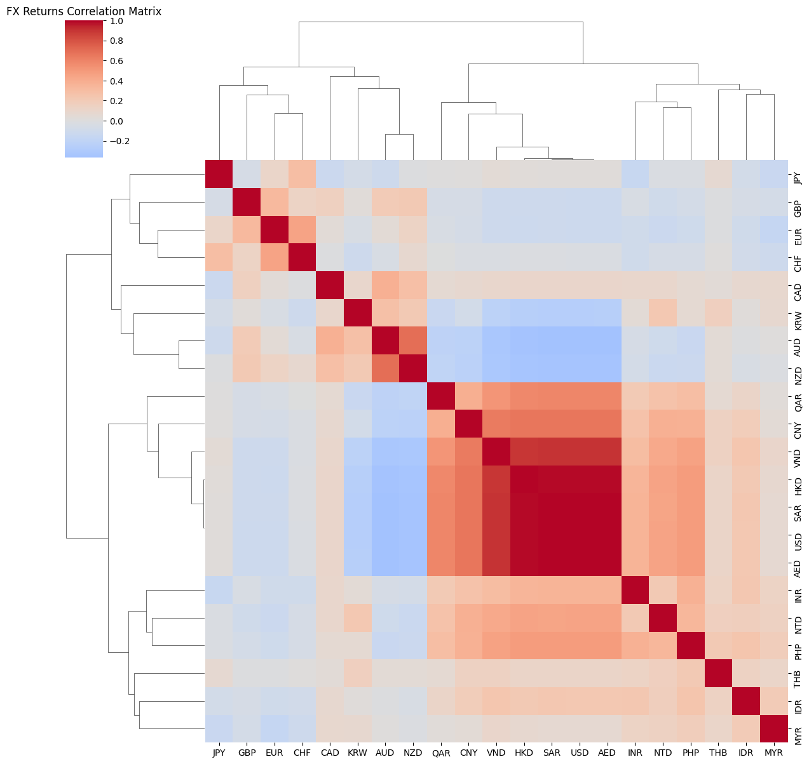

# 📊 SORA Analytics - Liquidity, FX, and Market Structure

A data-driven exploration of the **Singapore Overnight Rate Average (SORA)**, focusing on liquidity dynamics, calendar effects, and macro-financial relationships.

---

## 🧠 Overview

This project analyzes SORA using historical data, with an emphasis on:

* Understanding **liquidity conditions**
* Identifying **statistical patterns**
* Exploring **calendar and structural effects**
* Building toward **predictive/policy insights**

---

## 📦 Data Sources

* SORA historical data (MAS): https://eservices.mas.gov.sg/statistics/dir/DomesticInterestRates.aspx
* FX rates (MAS): https://eservices.mas.gov.sg/statistics/msb/exchangerates.aspx
* US Federal Reserve rates: https://www.macrotrends.net/datasets/2015/fed-funds-rate-historical-chart

---

# 🧪 Phase 1 - Data Exploration & Analysis

## 🔍 Objective

Understanding what lies in plain sight, before deeper analysis & predictive models. 

---

## 📊 1. Distribution of SORA Changes

**Method**

I analyze the distribution of daily changes in SORA with a simple .describe()

**Result**

```
Mean: ~0  
Std: 0.151  
Min/Max: -1.26 / +1.48  
Skew: +0.165
```

**Interpretation**

* Changes are centered around zero (low mean/std)
* Presence of **fat tails** (large but rare movements)
* Slight bias toward **upward spikes** (slight positive skew)

**Takeaway**

> SORA is typically stable but exhibits occasional large upward spikes.

---

## 🔁 2. Autocorrelation & Conditional Mean Reversion

**Method**

I compute lag-1 autocorrelation of SORA changes.

**Result**

```
Autocorrelation: -0.063
```

**Interpretation**

* Weak negative autocorrelation
* Indicates **mild mean reversion**

**Takeaway**

> Short-term SORA movements tend to partially reverse. If it goes up today it's slightly more likely to go back down tomorrow.

---

### Mean Reversion (Larger Movements)

**Method** 

Same as above but only when its above the standard deviation. 

**Result** 

```
Correlation ≈ -0.193
```

**Interpretation**

The correlation is 3x higher than the step before, with a decent predictive power. This means after a larger movement, SORA is much more likely to reverse direction, as if it is trying to correct an overreaction. 

**Takeaway**

> Mean reversion is state-dependent and is much stronger following a larger movement (defined here as above a standard deviation). 

---

## 📊 3. Liquidity Indicators (Range & Volume)

**Method**

I examine relationships between SORA and:

* Derived Intraday range (High - Low)
* Transaction volume

**Result**

```
Correlation (Range vs SORA): 0.755  
Correlation (Volume vs SORA): 0.25
```

**Interpretation**

* Strong relationship between **rate dispersion and SORA**
* Volume has weaker but noticeable influence

**Takeaway**

> Liquidity stress (captured by intraday range) is a **primary driver** of SORA movements.

---

### Range vs SORA change

However, when contrasted to the change in the SORA level and not SORA itself, the opposite happens. 

**Result**

```
Correlation = 0.032515
```

**Interpretation**

SORA vs Range has a 0.755 correlation but the change against range only has a 0.032. This disparity would suggest that the Range explains the level of SORA but not the movement of SORA. High range = stressed environment but doesn't tell us if the movement will be up or down.

**Takeaway**
> Intraday dispersion (range) reflects underlying liquidity conditions but does not directly predict the direction of SORA changes.

---

## 📅 4. Calendar Effects

### Weekday Analysis

**Method**

* Group SORA changes by weekday
* Perform statistical tests (t-test, ANOVA)

**Result**

```
Day of Week
Mon   -0.025125
Tue   -0.021063
Wed   -0.015225
Thu    0.001196
Fri    0.062349
```

```
ANOVA: F = 38.92, p < 0.001 (6.92e-32)
T-test (Friday vs others): p < 0.001 (2.65e-32)
```

**Interpretation**

* Significant differences across weekdays
* Friday shows higher average increases

---

### ⚡ Spike Analysis (Extreme Movements)

**Method**

I identify extreme SORA changes (defined here as >2 standard deviations) and analyze their distribution across weekdays.

**Result**

```
Chi-square test: χ² = 10.30, p = 0.036  

Positive spikes:
- Friday    : 46.7%
- Thursday  : 23.9%
- Monday    : 10.8%
- Tuesday   : 10.8%
- Wednesday : 7.6%

Negative spikes:
- Monday    : 24.4%
- Tuesday   : 23.4%
- Thursday  : 23.4%
- Wednesday : 20.4%
- Friday    : 8.1%
```

**Interpretation**

* Upward spikes incredibly concentrated at **end of week** (70.6%)
* Downward adjustments occur **at start of week** (47.8%)

**Takeaway**

> SORA exhibits a **weekly liquidity cycle**, where funding conditions tighten before the weekend and normalize afterward. Before the weekend liquidity tightens to cover 3 days of exposure (Sat, Sun, Mon) and loosens on Monday & Tuesday.

---

### Volatility by Weekday

**Result**
```
Day of week
Monday    : 0.147889
Tuesday   : 0.136473
Wednesday : 0.129108
Thursday  : 0.161204
Friday    : 0.161683
```

**Takeaway**

> Volatility high at end of week and craters on wednesday, combined with earlier findings where spikes are most common during these times - consistent with pre-weekend liquidity tightening.


---

## ⚡ 5. Spike Behavior

**Method**

I identify extreme movements defined here as a 2σ threshold.

**Result**

```text
Number of spikes: 190 out of ~3,300 observations (roughly 5.7%)
```

**Interpretation**

* Relatively frequent extreme events relative to normal distribution. **One can expect 1-2 spikes per month.**

**Takeaway**

> SORA dynamics are characterized by **fat tails and episodic stress events**.

---

### Spike Magnitude Distribution

**Results**
```
count    190.000000
mean      -0.003113
std        0.480090
min       -1.262600
25%       -0.401450
50%       -0.305100
75%        0.406625
max        1.482300
```

**Interpretation** 
* mean -0.003 (slightly negative but basically 0)
* std 0.48 (much larger than the std of sora_change which is 0.15, over 3x larger).

**Takeaway**
> Strangely enough spikes are symmetric overall - extreme events are large in both directions, not just upward. It seems to be a zero sum situation in which friday's upward spikes are negated by monday's downward spikes, reflecting rapid tightening and subsequent normalization cycles.

---

## ↕️ 6. SORA Movement Directional Symmetry 
**Method**

I identify whether changes, positive or negative are of the same magnitude.

**Result**

```
Positive mean: +0.0935
Negative mean: -0.0948
Std (pos): 0.1197
Std (neg): 0.1172
```

**Interpretation**

Magnitudes are almost symmetric.

**Takeaway**

> The size of upward and downward moves is similar BUT earlier I found that timing of the moves are asymmetric. SORA movements are directionally symmetric in magnitude, but asymmetric in timing, with increases concentrated toward the end of the week and decreases at the start.

---

## 🧪 7. Stationarity

**Method**

Augmented Dickey-Fuller (adfuller) test on SORA changes.

**Result**

```text
ADF Statistic: -16.08  
p-value: 5.38e-29
```

**Interpretation**

* Strong rejection of non-stationarity

**Takeaway**

> SORA changes are **stationary**, making them suitable for time-series modeling.

---

## 🎢 8.Volatility vs SORA rate

**Method**

I derive volatility by using the standard deviation of a rolling window from the sora_change column. The volatility is then correlated against the SORA rate.

**Result**

```
Correlation ≈ 0.319
```

**Interpretation**

Moderate positive correlation. When SORA is high the system is more unstable.

**Takeaway**

> Higher SORA levels are associated with increased volatility, suggesting tighter liquidity environments are more unstable. 

---

## 9. Fx Correlation

**Method**

I dumped the full range of currencies from the MAS website (which I believe should signify trading partners), calculate their percent changes and perform correlation to see how one movement affects another.

**Result**
 
 Some pretty plots (heatmap/clustermap)



**Takeaway**

Free-floating currencies (in this case EUR, JPY, KRW, GBP, CHF) demonstrate low correlation with USD when expressed against SGD, reflecting independent monetary policies and market-driven exchange rates.

Juxtaposed, managed and USD-linked currencies (CNY, VND, HKD, SAR, AED) show strong co-movement, indicating shared policy anchors and heavier exposure to USD.

## 10. Finding the SORA Coefficient

**Method**
I try to solve for β in the formula ΔSORA ≈ β × ΔFedRate. 

There are 3 methods I try to achieve this, all of which involve linear regression. The first, we take notice of a fed rate cut/hike event and then apply a 1 week window before and after. 

The second is a similar approach but we aggregate monthly resutls by using resample('M').

Finally, the third one uses lags to see if we can catch any sort of delayed transmission between the FED and SORA. 

**Result**

| Method                    |Beta (β)|R²     |
|---------------------------|--------|-------|
| Event Window              | ~0.28  | ~0.01 |
| Monthly Resampling        | ~0.30  | ~0.09 |
| Distributed lag regression| ~0.29  | ~0.008|

**Takeaway**
β can be expected to be, on average, between 0.28 and 0.3. A 1% change in the FED will lead to a 0.28-0.30% change in SORA. Since the FED typically targets 25 bps cuts or hikes at a time, I would expect the most common SORA adjustments to be around 7bps. 

However, with the low R² score, this rule seems to capture only about 9% of SORA variation, suggesting domestic liquidity conditions affect short-term dynamics to a greater degree (which can in turn be affected by events that caused the fed to have that adjustment).


# 🧠 Key Findings

* SORA is **stable most of the time**, with occasional large shocks
* Liquidity conditions (range) strongly influence rate movements
* A **weekly liquidity cycle** exists around weekends
* SORA exhibits **mean reversion and volatility clustering**
* Extreme events are more frequent than expected (fat tails)


# ⚠️ Disclaimer

This project is for educational and research purposes only.
It does not constitute financial advice.

---

# 🛠️ Tech Stack

* Python (Pandas, NumPy, SciPy)
* Statsmodels
* Scikit-learn
* Jupyter Notebook

---
