<p align="center">
  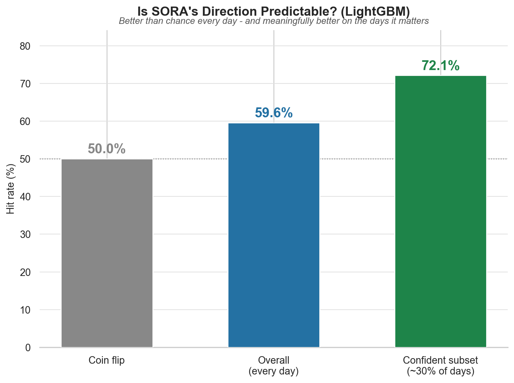
</p>

# SORA Direction Prediction & Model Interpretability
*Feature engineering, model comparison, natural language processing and confidence-aware forecasting for Singapore's Overnight Rate Average*

*Also known as chasing data morganas*

---

<p align="center">
  
</p>

## 📑 Table of Contents
1. [Overview](#-overview)
2. [Key Findings](#-key-findings)
3. [Data Sources / Datasets](#-data-sources)
4. [Phase 1 - Exploratory Data Analysis (EDA)](#-phase-1---data-exploration--analysis)
    - 4.1 [Summary Statistics](#-1-summary-statistics)
    - 4.2 [Autocorrelation & Conditional Mean Reversion](#-2-autocorrelation--conditional-mean-reversion)
        - 4.2.1 [Mean Reversion (Larger Movements)](#mean-reversion-larger-movements)
    - 4.3 [Liquidity Indicators (Range & Volume)](#-3-liquidity-indicators-range--volume)
        - 4.3.1 [Range vs SORA change](#range-vs-sora-change)
    - 4.4 [Calendar Effects](#-4-calendar-effects)
        - 4.4.1 [Weekday Analysis](#weekday-analysis)
        - 4.4.2 [Spike Analysis (Extreme Movements)](#-spike-analysis-extreme-movements)
        - 4.4.3 [Volatility by Weekday](#volatility-by-weekday)
    - 4.5 [Spike Behavior](#-5-spike-behavior)
        - 4.5.1 [Spike Magnitude Distribution](#spike-magnitude-distribution)
    - 4.6 [SORA Movement Directional Symmetry](#%EF%B8%8F-6-sora-movement-directional-symmetry)
    - 4.7 [Stationarity](#-7-stationarity)
    - 4.8 [Volatility vs SORA rate](#-8-volatility-vs-sora-rate)
    - 4.9 [FX Correlation](#9-fx-correlation) 
    - 4.10 [Finding the SORA Coefficient](#10-finding-the-sora-coefficient) 
        - 4.10.1 [Time-Varying Sensitivity of SORA to Fed Policy](#time-varying-sensitivity-of-sora-to-fed-policy)
5. [Phase 2 - Feature Engineering](#-phase-2---feature-engineering)
    - 5.1 [Lag & Momentum Features](#-1-lag--momentum-features)
    - 5.2 [Volatility & Regime Features](#-2-volatility--regime-features)
    - 5.3 [Mean Reversion Signals](#-3-mean-reversion-signals)
    - 5.4 [Calendar Effects](#-4-calendar-effects-1)
    - 5.5 [FX & Macro Signals](#-5-fx--macro-signals)
    - 5.6 [Policy & Regime Features](#-6-policy--regime-features)
    - 5.7 [Interaction Features](#-7-interaction-features)
    - 5.8 [Feature Engineering Key Takeaways](#-feature-engineering-key-takeaways)
6. [Phase 3 - Predictive Modeling](#-phase-3---predictive-modeling)
7. [Phase 4 - Model Optimization](#-phase-4---model-optimization)
    - 7.1 [Hyperparameter Tuning](#-1-hyperparameter-tuning)
    - 7.2 [Trying Other Model Types](#-2-trying-other-model-types)
8. [Phase 5 - The Confidence Discovery](#-phase-5---the-confidence-discovery)
    - 8.1 [Overall vs. Confident-Subset Accuracy](#-1-overall-vs-confident-subset-accuracy)
    - 8.2 [Does This Translate Into Something Useful?](#-2-does-this-actually-translate-into-something-useful)
    - 8.3 [What Makes a Day "Confident"?](#%EF%B8%8F-3-what-makes-a-day-confident)
    - 8.4 [The MAS Meeting Cycle](#%EF%B8%8F-4-the-mas-meeting-cycle)
9. [Phase 6 - Expanding the Feature Frontier](#-phase-6---expanding-the-feature-frontier)
    - 9.1 [The Broad Sweep](#-1-the-broad-sweep---mostly-null-and-thats-informative)
    - 9.2 [Three Rejected Features, Three Different Reasons](#-2-three-rejected-features-three-different-reasons)
10. [Phase 7 - MAS Statement Tone Analysis](#%EF%B8%8F-phase-7---does-mass-language-itself-carry-information)
    - 10.1 [Lexicon Score & Validation](#-1-building-and-validating-a-lexicon-score)
    - 10.2 [LLM-Scored Comparison](#-2-an-llm-scored-comparison)
    - 10.3 [Cross-Model Confirmation](#-3-neither-score-moves-the-needle---confirmed-four-different-ways)
11. [Phase 8 - Refining the Shadow-NEER](#-phase-8---refining-the-shadow-neer)
    - 11.1 [Time-Varying Weights](#%EF%B8%8F-1-time-varying-weights)
    - 11.2 [Domestic-Exports-Only Weighting (NODX)](#-2-domestic-exports-only-weighting-nodx)
    - 11.3 [Combining Both Fixes](#-3-combining-both-fixes)
12. [Limitations](#-limitations)
13. [Closing Thoughts](#-closing-thoughts)
14. [Disclaimer](#-disclaimer)
15. [Tech Stack](#%EF%B8%8F-tech-stack)
---
## 🧠 Overview
This project analyzes SORA using historical data, with an emphasis on:

* Understanding **liquidity conditions**
* Identifying **statistical patterns**
* Exploring **calendar and structural effects**
* Building toward **predictive/policy insights**

---

## 🧠 Key Findings

**On SORA's underlying behavior**
* SORA is **stable most of the time**, with occasional large shocks (fat tails, ~5.7% of days classified as spikes)
* A **weekly liquidity cycle** exists around weekends; upward spikes cluster on Fridays, downward corrections on Mondays
* SORA exhibits **mean reversion and volatility clustering**, and reversion strengthens after larger moves
* SORA's relationship with the Fed is real but unstable - a rolling beta swings from -2.8 to +1.15 over time, and a static linear model only explains ~9% of variance

**On predicting SORA's direction**
* Hyperparameter tuning and testing six other model types found a real ceiling around ~0.66 AUC - **LightGBM, properly tuned, ultimately won outright** (best AUC, Brier score, and F1 simultaneously), once every model got a fair search and the improved shadow-NEER feature (see Phase 8)
* **The model is far more useful selectively than uniformly**: ~59% accuracy across every day, ~75% on the ~30% of days it's actually confident about - this is the most useful result in the project in regards to prediction
* Confidence is explainable, not a black box - it clusters around Fridays and high-rate regimes, the same two features that dominate the model overall
* Ten additional data sources (oil, yields, VIX, GARCH, technical indicators, MAS statement tone via both a lexicon and an LLM) were tested rigorously; nearly all converged to a null result, suggesting a genuine ceiling for numeric/technical features on this task
* Three different "rejected" features failed for three different, informative reasons: redundancy (GARCH duplicating `vol_5`), genuine non-use confirmed across four model architectures (MAS statement tone), and real-but-wrong-target signal (MACD/RSI predict magnitude, not direction)

---
## 📦 Data Sources

* SORA historical data (MAS): https://eservices.mas.gov.sg/statistics/dir/DomesticInterestRates.aspx
* FX rates (MAS): https://eservices.mas.gov.sg/statistics/msb/exchangerates.aspx
*  S\$ Nominal Effective Exchange Rate Index - \$NEER (MAS): https://www.mas.gov.sg/statistics/exchange-rates/s$neer
*  List of Monetary Policy Decisions (MAS): https://www.mas.gov.sg/monetary-policy/past-monetary-policy-decisions
* SGS Prices and Yields (MAS): https://eservices.mas.gov.sg/statistics/fdanet/BenchmarkPricesAndYields.aspx
* Singapore Public Holidays consolidated (Ministry of Manpower): https://data.gov.sg/datasets/d_8ef23381f9417e4d4254ee8b4dcdb176/view
* Singapore Merchandise Trade by Region/ Market (Singapore Department of Statistics): https://data.gov.sg/datasets/d_8a9fb1409830202a0b06c222ffabc36a/view
* US Federal Reserve rates: https://www.macrotrends.net/datasets/2015/fed-funds-rate-historical-chart
* Market Yield on U.S. Treasury Securities (FRED): https://fred.stlouisfed.org/series/dgs10
* Brent/WTI prices (U.S. Energy Information Administration): https://www.eia.gov/dnav/pet/pet_pri_spt_s1_d.htm
* HIBOR historical data (Census and Statistics Department Hong Kong): https://www.censtatd.gov.hk/en/web_table.html?id=340-45022#
* Non-Oil Domestic Exports (NODX) By Selected Market (Singapore Department of Statistics): https://data.gov.sg/datasets/d_834e3f2d1179548cb378bec4bd61c988/view


---

# 🔬 Phase 1 - Data Exploration & Analysis

## 🔍 Objective

Understanding what lies in plain sight, before deeper analysis & predictive models. 

---

## 📊 1. Summary Statistics

**Method**

I analyze the distribution of daily changes in SORA with a simple .describe()

**Result**

```
Mean: ~0  
Std: 0.149 
Min/Max: -1.26 / +1.48  
Skew: +0.165
```

**Interpretation**

* Changes are centered around zero (low mean/std)
* Presence of **fat tails** (large but rare movements)
* Slight bias toward **upward spikes** (slight positive skew)

**Takeaway**

> SORA is typically stable but exhibits occasional large upward spikes.

---

## 🔁 2. Autocorrelation & Conditional Mean Reversion

**Method**

I compute lag-1 autocorrelation of SORA changes.

**Result**

```
Autocorrelation: -0.063
```

**Interpretation**

* Weak negative autocorrelation
* Indicates **mild mean reversion**

**Takeaway**

> Short-term SORA movements tend to partially reverse. If it goes up today it's slightly more likely to go back down tomorrow.

---

### Mean Reversion (Larger Movements)

**Method** 

Same as above but only when its above the standard deviation. 

**Result** 

```
Correlation ≈ -0.193
```

**Interpretation**

The correlation is 3x higher than the step before, with a decent predictive power. This means after a larger movement, SORA is much more likely to reverse direction, as if it is trying to correct an overreaction. 

**Takeaway**

> Mean reversion is state-dependent and is much stronger following a larger movement (defined here as above a standard deviation). 

---

## 📊 3. Liquidity Indicators (Range & Volume)

**Method**

I examine relationships between SORA and:

* Derived Intraday range (High - Low)
* Transaction volume

**Result**

```
Correlation (Range vs SORA): 0.755  
Correlation (Volume vs SORA): 0.25
```

**Interpretation**

* Strong relationship between **rate dispersion and SORA**
* Volume has weaker but noticeable influence

**Takeaway**

> Liquidity stress (captured by intraday range) is a **primary driver** of SORA movements.

---

### Range vs SORA change

However, when contrasted to the change in the SORA level and not SORA itself, the opposite happens. 

**Result**

```
Correlation = 0.032515
```

**Interpretation**

SORA vs Range has a 0.755 correlation but the change against range only has a 0.032. This disparity would suggest that the Range explains the level of SORA but not the movement of SORA. High range = stressed environment but doesn't tell us if the movement will be up or down.

**Takeaway**
> Intraday dispersion (range) reflects underlying liquidity conditions but does not directly predict the direction of SORA changes.

---

## 📅 4. Calendar Effects

### Weekday Analysis

**Method**

* Group SORA changes by weekday
* Perform statistical tests (t-test, ANOVA)

**Result**

```
Day of Week
Mon   -0.025125
Tue   -0.021063
Wed   -0.015225
Thu    0.001196
Fri    0.062349
```

```
ANOVA: F = 38.92, p < 0.001 (6.92e-32)
T-test (Friday vs others): p < 0.001 (2.65e-32)
```

**Interpretation**

* Significant differences across weekdays
* Friday shows higher average increases

---

### ⚡ Spike Analysis (Extreme Movements)

**Method**

I identify extreme SORA changes (defined here as >2 standard deviations) and analyze their distribution across weekdays.

**Result**
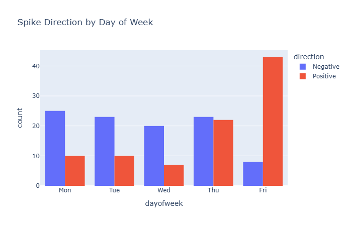
```
Chi-square test: χ² = 10.30, p = 0.036  

Positive spikes:
- Friday    : 46.7%
- Thursday  : 23.9%
- Monday    : 10.8%
- Tuesday   : 10.8%
- Wednesday : 7.6%

Negative spikes:
- Monday    : 24.4%
- Tuesday   : 23.4%
- Thursday  : 23.4%
- Wednesday : 20.4%
- Friday    : 8.1%
```

**Interpretation**

* Upward spikes incredibly concentrated at **end of week** (70.6%)
* Downward adjustments occur **at start of week** (47.8%)

**Takeaway**

> SORA exhibits a **weekly liquidity cycle**, where funding conditions tighten before the weekend and normalize afterward. Before the weekend liquidity tightens to cover 3 days of exposure (Sat, Sun, Mon) and loosens on Monday & Tuesday.

---

### Volatility by Weekday

**Result**
```
Day of week
Monday    : 0.147889
Tuesday   : 0.136473
Wednesday : 0.129108
Thursday  : 0.161204
Friday    : 0.161683
```

**Takeaway**

> Volatility high at end of week and craters on wednesday, combined with earlier findings where spikes are most common during these times - consistent with pre-weekend liquidity tightening.


---

## ⚡ 5. Spike Behavior

**Method**

I identify extreme movements defined here as a 2σ threshold.

**Result**

```text
Number of spikes: 190 out of ~3,300 observations (roughly 5.7%)
```

**Interpretation**

* Relatively frequent extreme events relative to normal distribution. **One can expect 1-2 spikes per month.**

**Takeaway**

> SORA dynamics are characterized by **fat tails and episodic stress events**.

---

### Spike Magnitude Distribution

**Results**
```
count    190.000000
mean      -0.003113
std        0.480090
min       -1.262600
25%       -0.401450
50%       -0.305100
75%        0.406625
max        1.482300
```

**Interpretation** 
* mean -0.003 (slightly negative but basically 0)
* std 0.48 (much larger than the std of sora_change which is 0.15, over 3x larger).

**Takeaway**
> Strangely enough spikes are symmetric overall - extreme events are large in both directions, not just upward. It seems to be a zero sum situation in which friday's upward spikes are negated by monday's downward spikes, reflecting rapid tightening and subsequent normalization cycles.

<br></br>
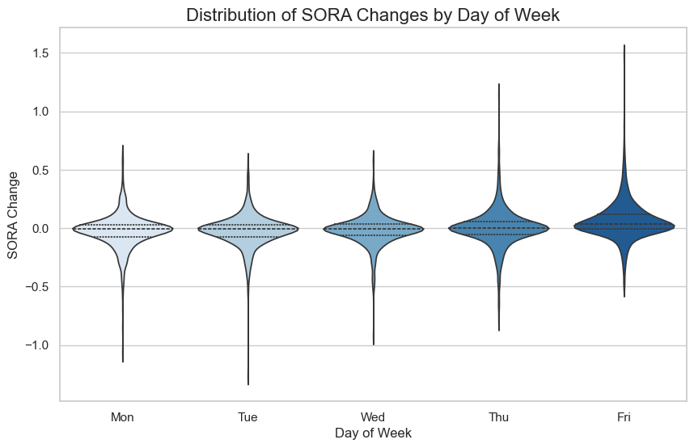

---

## ↕️ 6. SORA Movement Directional Symmetry 
**Method**

I identify whether changes, positive or negative are of the same magnitude.

**Result**

```
Positive mean: +0.0935
Negative mean: -0.0948
Std (pos): 0.1197
Std (neg): 0.1172
```

**Interpretation**

Magnitudes are almost symmetric.

**Takeaway**

> The size of upward and downward moves is similar BUT earlier I found that timing of the moves are asymmetric. SORA movements are directionally symmetric in magnitude, but asymmetric in timing, with increases concentrated toward the end of the week and decreases at the start.

---

## 🧪 7. Stationarity

**Method**

Augmented Dickey-Fuller (adfuller) test on SORA changes.

**Result**

```text
ADF Statistic: -16.08  
p-value: 5.38e-29
```

**Interpretation**

* Strong rejection of non-stationarity

**Takeaway**

> SORA changes are **stationary**, making them suitable for time-series modeling.

---

## 🎢 8. Volatility vs SORA rate

**Method**

I derive volatility by using the standard deviation of a rolling window from the sora_change column. The volatility is then correlated against the SORA rate.

**Result**

```
Correlation ≈ 0.319
```

**Interpretation**

Moderate positive correlation. When SORA is high the system is more unstable.

**Takeaway**

> Higher SORA levels are associated with increased volatility, suggesting tighter liquidity environments are more unstable. 

---

## 9. Fx Correlation

**Method**

I dumped the full range of currencies from the MAS website (which I believe should signify trading partners), calculate their percent changes and perform correlation to see how one movement affects another.

**Result**
 
Some pretty plots (heatmap/clustermap)
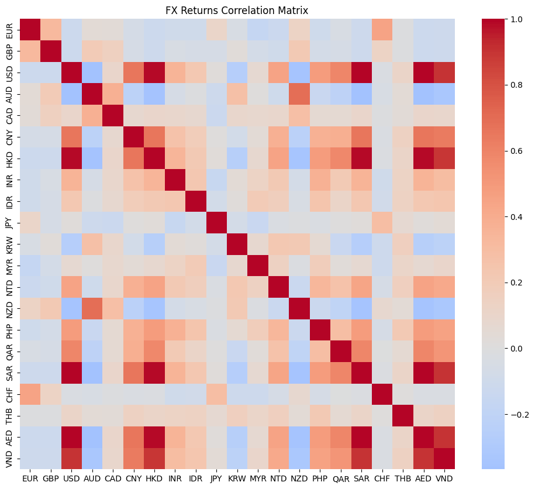
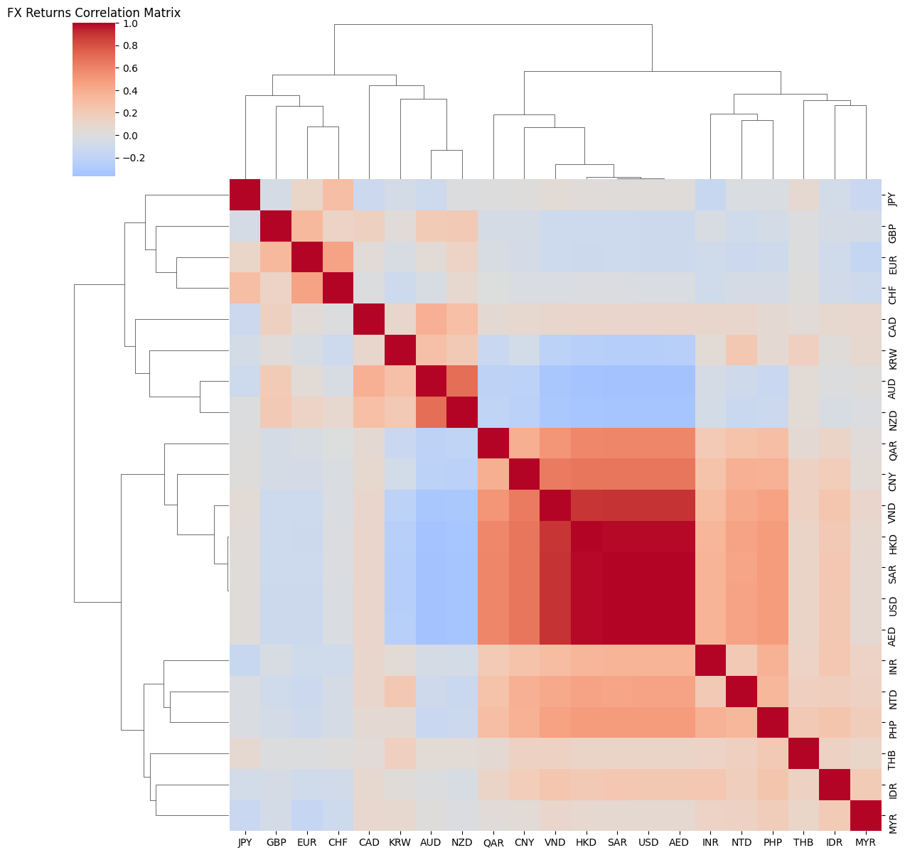

**Takeaway**

Free-floating currencies (in this case EUR, JPY, KRW, GBP, CHF) demonstrate low correlation with USD when expressed against SGD, reflecting independent monetary policies and market-driven exchange rates.

Juxtaposed, managed and USD-linked currencies (CNY, VND, HKD, SAR, AED) show strong co-movement, indicating shared policy anchors and heavier exposure to USD.

## 10. Finding the SORA Coefficient

**Method**

I try to solve for β in the formula ΔSORA ≈ β × ΔFedRate. 

There are 3 methods I try to achieve this, all of which involve linear regression. The first, we take notice of a fed rate cut/hike event and then apply a 1 week window before and after. 

The second is a similar approach but we aggregate monthly results by using resample('M').

Finally, the third one uses lags to see if we can catch any sort of delayed transmission between the FED and SORA. 

**Result**

| Method                    |Beta (β)|R²     |
|---------------------------|--------|-------|
| Event Window              | ~0.28  | ~0.01 |
| Monthly Resampling        | ~0.30  | ~0.09 |
| Distributed lag regression| ~0.29  | ~0.008|

**Takeaway**

β can be expected to be, on average, between 0.28 and 0.3. A 1% change in the FED will lead to a 0.28-0.30% change in SORA. Since the FED typically targets 25 bps cuts or hikes at a time, I would expect the most common SORA adjustments to be around 7bps. 

However, with the low R² score, this rule seems to capture only about 9% of SORA variation, suggesting domestic liquidity conditions affect short-term dynamics to a greater degree (which can in turn be affected by events that caused the fed to have that adjustment).

---

### Time-Varying Sensitivity of SORA to Fed Policy


A while later I realized ΔSORA ≈ β × ΔFedRate is much too simple - as my AUC and Brier score began to improve I felt something was amiss. This came in the form of realizing there is absolutely nothing stopping the β value from changing every day, and as such the original forumla treats it as a constant when that cannot be the case. 

**Method**

I took a 1 year window (252 days) and calculate the β every day.

**Result**
```
count    3071.000000
mean       -0.207523
std         0.730367
min        -2.830172
25%        -0.758095
50%        -0.015442
75%         0.340256
max         1.154763
```

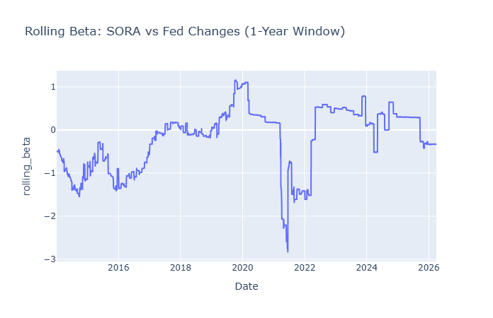

**Takeaway**

- β > 0 → SORA moves *with* Fed

- β ≈ 0 → Fed irrelevant

- β < 0 → SORA moves *opposite* Fed

The relationship between SORA and Federal Reserve rate changes is highly unstable over time, with rolling betas fluctuating between positive and negative values. This suggests that the transmission mechanism is NOT constant, and simple linear models fail to capture this dynamic.


---

# 🧪 Phase 2 - Feature Engineering

## 🎯 Objective

Extract predictive signals from raw SORA and FX data by capturing:
- Short-term price dynamics
- Volatility
- Mean reversion behavior
- Macro and policy context

---

## Feature Groups

---

## 🔁 1. Lag & Momentum Features

Capture short-term autocorrelation and directional persistence in SORA.

```lag1, lag2, lag3```

**Takeaway**:

SORA exhibits short-term dependency, showing that recent movements hold predictive power over the near future.

---

## 🌊 2. Volatility & Regime Features

Capture changing market conditions and environmental stress.

```
- vol_5, sora_vol_5/10/20/30
- vol_percentile
- stress_regime
- range_z
```

**Takeaway**:

Volatility spikes (e.g. COVID) significantly alter dynamics and predictive ability.

---

## 🔄 3. Mean Reversion Signals

Capture deviations from the norm and expected pullbacks.

```
- reversion_signal
- distance_from_mean
- sora_level_z
```

**Takeaway**:

SORA tends to revert under normal conditions, but this behavior strengthens during spikes and weakens within high stress environments.

---

## 📅 4. Calendar Effects

Account for systematic temporal behavioural patterns.

```
- is_friday, is_monday
- month, is_month_end
- quarter
```

**Takeaway**:

End-of-week and end-of-month effects reflect liquidity cycles and institutional positioning, having a positive correlation with SORA rising, while the opposite is true. 

---

## 💱 5. FX & Macro Signals

Incorporate external drivers from currency markets / assumed trading partners. These currencies are against SGD so their percent changes (relative movements) are calculated and lagged. 

```
- NZD_ret_lag1, CNY_ret_lag1, KRW_ret_lag1, etc.
- CAD_vol_5
```

**Takeaway**:

FX movements act as leading indicators for rate changes in open economies, and reflect an underlying abstract relationship. 

---

## 🏦 6. Policy & Regime Features

Model the impact of monetary policy decisions.

```
- mas_event (whether there was a meeting that day)
- days_since_mas
- sora_regime
- neer, neer_ret_5, neer_ret_20, neer_z
```

**Takeaway**:

Policy timing and regime shifts influence rate behavior beyond pure market signals. Even foreknowledge of a meeting can influence the market. 

---

## 🔗 7. Interaction Features

Capture non-linear relationships between signals.

```
- lag1_high_vol
```

**Takeaway**:

Feature interactions help model regime-dependent behavior (e.g. lag effects differ under high volatility).

---

## 🧠 Feature Engineering Key Takeaways
- Feature engineering was the primary driver of model performance
- Different feature groups capture distinct market regimes:
    - Volatility → crisis periods
    - Mean reversion → stable environments
    - FX & policy → macro-driven shifts
- Combining these signals enabled the model to reach 0.6-0.7 AUC, indicating strong predictive structure in SORA dynamics

---

# 🤖 Phase 3 - Predictive Modeling

### Objective
Predict direction of SORA changes.

### Models Used
- Linear Regression
- Logistic Regression
- XGBoost
- CatBoost
- LightGBM
- Support Vector Classifier 

### Evaluation Metrics
- ROC-AUC
- F1 Score (for tuned models)
- Brier Score (for tuned models)

### Results
Truncated to 3 significant figures 

| Model | AUC | 
|------|--------|
| LightGBM (base) | 0.657 | 
| CatBoost (base) | 0.645 | 
| XGBoost (base)  | 0.642 | 
| Random Forest (base) | 0.638 |
| SVC (base) | 0.616 | 
| Logistic Regression (base) | 0.627 |
| LSTM (base) | 0.627 | 

### Key Insight
- Calendar effects (especially Friday) dominate predictions
- Mean reversion provides secondary signal

# 🚀 Phase 4 - Model Optimization

## 🎯 Objective

The Phase 3 XGBoost scored well on the original feature set. Before trying to extend the feature set further, I wanted to make sure I was squeezing everything I could out of what I already had.

---

## 🔧 1. Hyperparameter Tuning

**Method**

Walk-forward-safe `RandomizedSearchCV` over `max_depth`, `learning_rate`, `n_estimators`, `subsample`, `colsample_bytree`, `min_child_weight`, `reg_alpha`, `reg_lambda` - searched only within a training window, then evaluated on a held-out final fold neither the search nor the model ever saw during tuning.

**Result**

```
Default hyperparameters: AUC ≈ 0.62
Tuned hyperparameters:   AUC ≈ 0.66
```

**Interpretation**

A real, meaningful gain - but this is close to a ceiling. Further tuning attempts (wider search, more iterations) stopped moving the number.

**Takeaway**

> Tuning bought a genuine ~2 points of AUC. It's not free though; once a model's hyperparameters are in a reasonable neighborhood, further gains have to come from better features, not more search.

---

## 🥊 2. Trying Other Model Types

**Method**

Tested SVC, LSTM, LightGBM, CatBoost, Random Forest, and a soft-voting ensemble against XGBoost - every model given an equally fair, walk-forward-safe hyperparameter search (`RandomizedSearchCV`, or a manual sweep for LSTM given its sequence structure), evaluated on the final, improved feature set including the refined shadow-NEER (see Phase 8).

**Result**

<u>Tuned Models</u>

| Model | AUC | F1 Score | Brier score|
|------|--------|-----|-----|
| LightGBM (tuned) | 0.657 | 0.603 | 0.233 |
| CatBoost (tuned) | 0.645 | 0.571 | 0.239 |
| XGBoost (tuned)  | 0.642 | 0.576 | 0.235 |
| Random Forest (tuned) | 0.638 | 0.577 | 0.237 |
| SVC (tuned) | 0.630 | 0.513 | 0.257 |
| Logistic Regression (tuned) | 0.627 | 0.535 | 0.265 |
| LSTM (tuned) |  0.6302 | 0.2653 | 0.6043


<u>Comparison with Base</u>

| Model | AUC (Tuned) | AUC (Base) | Pct Change |
|------|--------|-----|-----|
| LightGBM  | 0.657 |0.603 | +8.9% |
| CatBoost  | 0.645 | 0.630 | +2.51% |
| XGBoost   | 0.642 | 0.581 | +10.38% |
| Random Forest  | 0.616 | 0.577 | +0.77% |
| SVC  | 0.630 | 0.622 | +2.21% |
| Logistic Regression | 0.627 | 0.622 | +0.82% |
| LSTM  |  0.6302 | 0.6275 | +0.43%


**Interpretation**

LightGBM wins outright - not just on AUC, but on Brier score and F1 simultaneously, the strongest possible version of a win across three different measures of model quality. Tree-based models generally have a real structural edge here, likely because the strongest signals (calendar effects, regime flags) are naturally the kind of thing trees exploit well; LightGBM's leaf-wise growth strategy apparently exploits that structure slightly better than XGBoost's level-wise approach on this particular dataset. LSTM needing more data than this dataset provides is unsurprising, not a failure of the approach. The ensemble losing to its own best component is a good reminder that combining models isn't automatically better - it helps most when the base models make genuinely different kinds of mistakes, which wasn't really the case here.

**Takeaway**

> LightGBM, properly tuned, is the best-performing model on this task. A clean sweep across AUC, calibration, and F1. Model selection had already reached its ceiling once every model was given a fair shot; the real gains from here had to come from feature quality (see Phase 8), not algorithm choice.

---

# 🎯 Phase 5 - The Confidence Discovery

## 🧠 The Idea

An AUC of 0.66 across *every single day* undersells what's actually happening. Some days the model has real signal; others it's essentially guessing. What if the model itself could tell the difference?

---

## 📈 1. Overall vs. Confident-Subset Accuracy

**Method**

For every prediction, take `|P(up) - 0.5|` as a confidence score. Sweep a threshold - only act when confidence clears the bar, otherwise abstain - and track accuracy and coverage (% of days a call gets made) at each threshold.

**Result**


```
threshold  coverage  accuracy
0.00       100.0%    59.6%
0.05        58.5%    64.8%
0.11        31.7%    72.1%
0.16        18.5%    75.3%
```

The chart above shows the "big number" summary; the full accuracy/coverage tradeoff curve behind it looks like this:

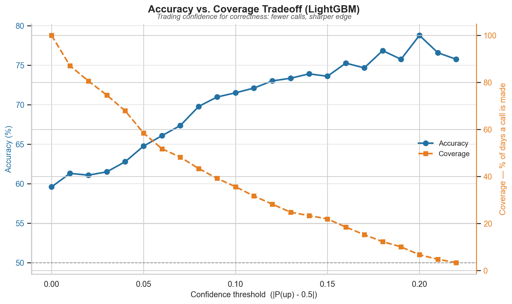

**Interpretation**

Accuracy climbs steadily as the bar for "act on this" rises. At a threshold giving ~30% coverage, the model is right better than 7 times out of 10 - on a meaningful third of days, not a cherry-picked handful. (Numbers reflect LightGBM, the model that ultimately won the fair comparison in Phase 4 - recalibrated after both a mid-project data refresh and the switch away from XGBoost, since a fixed confidence threshold doesn't automatically transfer between models or across a changing dataset.)

**Takeaway**

> The model isn't uniformly ~60% accurate. It's occasionally very sure and usually right, and often unsure and closer to a coin flip. Knowing which is which turns out to matter more than any single AUC number.

---

## 💰 2. Does This Actually Translate Into Something Useful?

**Method**

Backtest two strategies walk-forward: trade every day, vs. trade only on the days that clear the confidence threshold (sit out otherwise).

**Result**

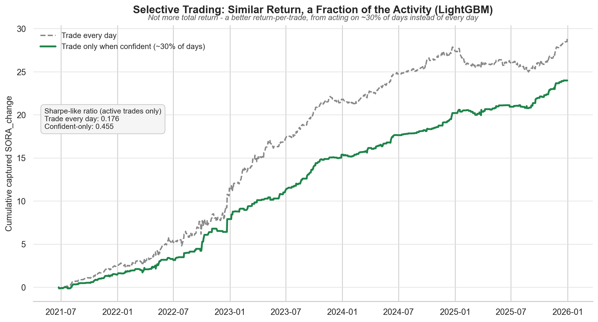

```
Trade every day:    total captured = 28.93   |  Sharpe-like ratio (active days) = 0.176
Confident-only:     total captured = 24.00   |  Sharpe-like ratio (active days) = 0.455
Confident-only trades on ~31.6% of days vs. 100% for full coverage
```

**Interpretation**

Full coverage ends with a higher *raw total* - it's trading every single day, so that's expected, not a contradiction. The real story is efficiency: the confident-only strategy captures ~83% of the total return while being active less than a third as often, more than doubling the Sharpe-like ratio per trade taken.

**Takeaway**

> This isn't "the selective strategy wins outright" - it's "similar payoff, a fraction of the exposure." That's a more honest and, I'd argue, more useful finding than a bigger total return would have been.

---

## 🗓️ 3. What Makes a Day "Confident"?

**Method**

Cross-reference confident vs. non-confident days against `days_since_mas`, `is_friday`, and `sora_regime` - the same three features that dominate SHAP importance.

**Result**

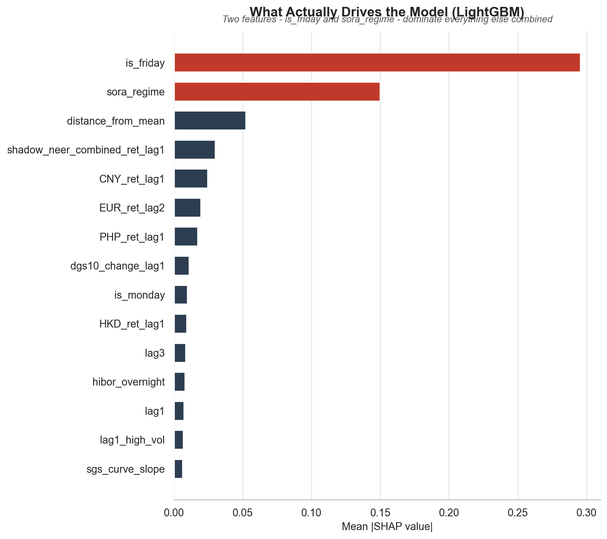

```
Friday share:        33.3% (confident days) vs. 5.4% (non-confident)  - a 6.2x difference
sora_regime share:    60.6% (confident days) vs. 26.9% (non-confident) - a 2.3x difference
days_since_mas:       66.3 avg (confident) vs. 62.1 avg (non-confident) - a smaller effect
```

**Interpretation**

Confidence isn't random - it clusters heavily around Fridays and high-rate-regime days, and the effect is if anything sharper for LightGBM than it was for XGBoost. `is_friday` and `sora_regime` alone account for more SHAP importance than everything else in the model combined; the refined shadow-NEER feature (Phase 8) now ranks 4th, meaningfully ahead of where it sat under the original construction.

**Takeaway**

> The model mostly knows what it knows on Fridays, and mostly when SORA is already in a high-rate regime. That's a mechanistic, explainable reason for the confidence pattern - not a black box coincidence.

---

## 〰️ 4. The MAS Meeting Cycle

**Method**

Bucket hit rate by `days_since_mas` in 15-day windows.

**Result**

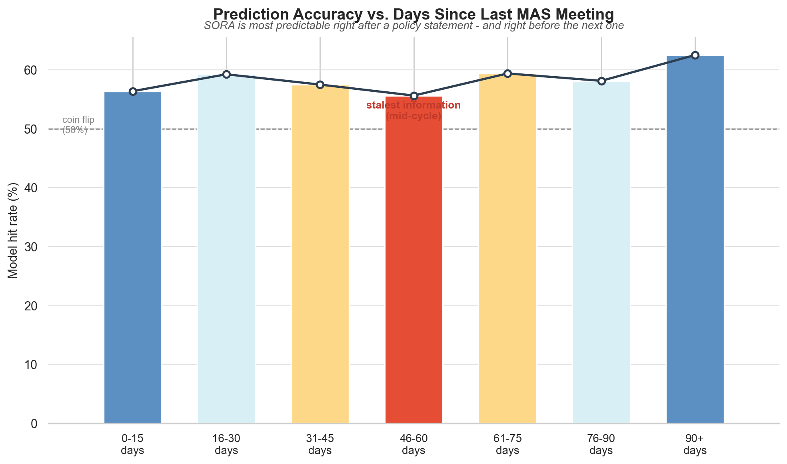

```
0-15 days:   ~56-63%  (moved after a mid-project data refresh - see below)
46-60 days:  lowest bucket in every version tested
90+ days:    among the highest in every version tested
```

**Interpretation**

A visually clean U-shape appeared here initially, but it's a good example of something that didn't survive proper scrutiny. Two follow-up checks, run specifically because the shape looked *too* clean: (1) a mid-project data refresh (a few more months of real data) reshuffled the walk-forward fold boundaries enough that the original post-meeting spike disappeared, leaving only a shallower mid-cycle dip; (2) a Wilson confidence-interval check found **every bucket's interval overlaps every other bucket's** - none of the differences are statistically distinguishable from noise, even at finer bucket resolution extending out to genuine semi-annual gaps (150-180+ days). A related hypothesis - that FX markets "price in" MAS's decision in the weeks before a meeting - also failed a proper split-sample validation (a promising correlation on one half of the data didn't replicate on the other half).
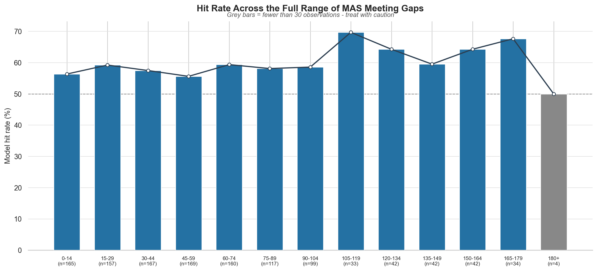

**Takeaway**

> A pattern that looks clean on one snapshot of data isn't the same as a confirmed finding. This one didn't survive a data refresh, a confidence-interval check, or a held-out validation test - worth reporting as "a suggestive pattern worth revisiting as more MAS meetings accumulate data", not a settled result. Catching this is arguably a better outcome than a clean-looking chart that never got checked.

---

# 🔍 Phase 6 - Expanding the Feature Frontier

## 🎯 Objective

With model selection and hyperparameters near their ceiling, the obvious next lever was new information. Pulled in oil prices (WTI, Brent), the US 10Y yield, Singapore's own SGS yield curve, Hong Kong HIBOR, VIX, RSI, MACD, GARCH-modeled volatility, and SORA's own transaction volume (present in the raw data since day one, never actually tested until now).

---

## 📉 1. The Broad Sweep - Mostly Null, and That's Informative

**Method**

Each source added to the full feature set, tested via the same walk-forward AUC comparison used throughout.

**Result**

```
Oil, US 10Y yield, SGS/HIBOR:  +0.006 AUC (small, real, plausibly worthwhile)
VIX:                            -0.001 AUC (a wash)
GARCH:                          -0.006 AUC alongside vol_5
RSI + MACD (added alongside):   -0.011 AUC
CNY/Budget Day event flags:     -0.003 AUC (partial-coverage window)
```

**Interpretation**

Across nearly ten independently-sourced signals, almost everything landed within noise of the existing baseline. Given how many different data types were tried - commodities, sovereign yields, volatility indices, technical indicators - this convergence is itself a finding: it suggests a real ceiling for numeric, macro/technical features on this specific prediction task, not a string of unlucky attempts.

**Takeaway**

> Ten different data sources, one consistent answer. That's stronger evidence of a genuine ceiling than any single null result could be on its own.

---

## 🔬 2. Three Rejected Features, Three Different Reasons

**Method**

"Add it and see if AUC moves" turned out to hide real information in a couple of cases - a feature can lose a split-selection competition against a stronger, correlated feature without being worthless. Followed up with a direct swap test (replace, don't just add) and literal split-usage counts for the more promising candidates.

**Result**

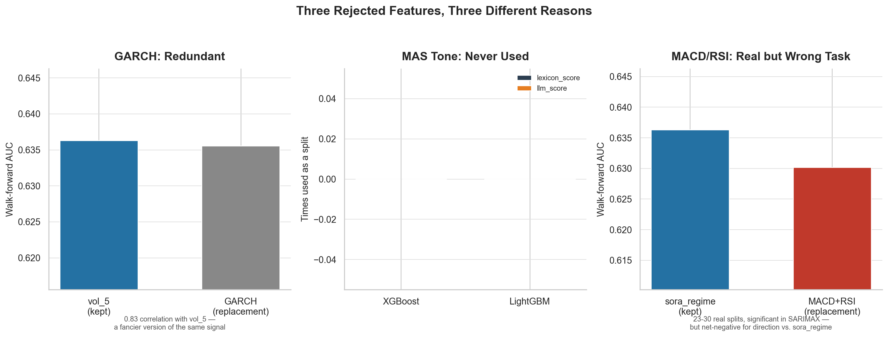

```
GARCH:        0.83 correlation with vol_5 - a fancier calculation of a signal already present
MAS tone:     0 splits used across XGBoost, LightGBM, CatBoost, and 0.545-0.997 p-values in SARIMAX
MACD/RSI:     23-30 real splits used, statistically significant coefficients in SARIMAX,
              but net-negative (-0.021 AUC) when swapped in for sora_regime directly
```

**Interpretation**

Three different stories hiding behind one word ("rejected"):
- **GARCH** is a *redundancy* - more principled math, same underlying information `vol_5` already provides.
- **MAS tone** (see Phase 9) is *truly unused* - confirmed across four completely different model architectures, not an artifact of any one algorithm's quirks.
- **MACD/RSI** are *real but wrong for this task* - used by trees, statistically significant in a linear model of `SORA_change` magnitude, but that information doesn't help *directional* classification once regime/reversion features are already doing similar work.

**Takeaway**

> Not every rejected feature fails for the same reason. Distinguishing "redundant," "unused," and "real signal for the wrong target" turned this from three shrugs into three actual findings.

---

# 🗣️ Phase 7 - Does MAS's Language Itself Carry Information?

## 🎯 Objective

Every feature so far has been numeric - prices, rates, calendar flags. MAS's actual policy statements are the sole different *kind* of information available: qualitative language rather than a time series.

---

## 📖 1. Building and Validating a Lexicon Score

**Method**

Scraped all 61 Monetary Policy Statements (2001–2026) and scored each on a hawkish/dovish keyword lexicon, with basic negation handling (so "we do *not* expect further increases" doesn't get miscounted as hawkish).

**Result**

```
Most dovish:  April 2025 (-37.2)  →  actual decision: "Reduce slightly"
Most hawkish: July 2026 (+4.9)    →  actual decision: "Increase very slightly"
```

**Interpretation**

The lexicon tracks real, known policy direction correctly at the extremes - a good sanity check before trusting it on the harder, more ambiguous statements.

**Takeaway**

> A simple keyword count, done carefully, gets the obvious cases right. That's the bar it needs to clear before being trusted on anything subtler.

---

## 🤖 2. An LLM-Scored Comparison

**Method**

Scored the same 61 statements independently with an LLM, using a fixed rubric (-5 to +5), judged standalone with no hindsight about how markets actually reacted.

**Result**

```
Correlation with lexicon score: 0.67
```

**Interpretation**

Strong enough to confirm both are measuring the same real thing - statement tone - but different enough (33% of the variance) that they're truly distinct signals, not just two versions of the same measurement.

**Takeaway**

> Two independent scoring methods, meaningfully correlated but not identical. Worth testing both rather than assuming either one is "the" answer.

---

## 🧪 3. Neither Score Moves the Needle - Confirmed Four Different Ways

**Method**

Tested same-day encoding, persistence/decay variants (does a statement's tone linger for weeks after?), redundancy against the existing `slope_direction` encoding, and - critically - actual split-usage counts across XGBoost, LightGBM, and CatBoost, plus SARIMAX coefficient significance.

**Result**

```
XGBoost:   0 splits used, either score
LightGBM:  0 splits used
CatBoost:  near-zero importance (0.005-0.048), AUC unchanged
SARIMAX:   llm_score p=0.545, lexicon_score p=0.997 - nowhere close to significant
           (lag1, vol_5, is_friday all p<0.01 in the same regression, confirming the test itself works)
```

**Interpretation**

Four completely different modeling paradigms - tree-based, boosted, and classical linear - agree. This isn't one algorithm's blind spot; the tone signal, however it's measured, simply isn't adding information the model doesn't already have some other way of capturing.

**Takeaway**

> Unfortunately, converging evidence across four model types is about as solid a null result as this kind of analysis can produce. Statement tone doesn't help predict next-day direction - not because of a modeling artifact, but because the information appears to already be captured through the categorical policy encoding and market-reaction features already in the model.

---

# 🧮 Phase 8 - Refining the Shadow-NEER

## 🎯 Objective

The trade-share-weighted shadow-NEER (Phase 6) was always a deliberate simplification: one static weight vector, averaged over 2021-2023, applied uniformly across the entire 2013-2026 sample, built from total merchandise trade (which includes goods just passing through Singapore's ports, not really originating here). Two specific, nameable flaws - not vague dissatisfaction - worth fixing on their own economic merits rather than searching for an unrelated replacement.

---

## 🕰️ 1. Time-Varying Weights

**Method**

Rather than one fixed vector for 13 years, computed a fresh weight vector for *each* year using that
year's own trade data (available back to 2013), applying each year's weights only to that year's FX data.
For 2024+ (beyond the trade data's coverage), carried forward 2023's weights as the most recent available estimate.

**Result**

```
Mean AUC - time-varying weights: 0.6416
Mean AUC - original static trade-share: 0.6363
```

**Interpretation**

A real, if modest, gain from fixing a genuine flaw: a snapshot from one 3-year window doesn't reflect how Singapore's trade mix actually shifted across more than a decade.

**Takeaway**

> Averaging 13 years of trade relationships into a single number was always a simplification. Letting the weights actually move with the data they're supposed to represent helped, exactly as it should.

---

## 📦 2. Domestic-Exports-Only Weighting (NODX)

**Method**

Total merchandise trade includes re-exports - goods that pass through Singapore without originating or terminating there, a well-known distortion given Singapore's entrepôt trade. Singapore's official Non-Oil Domestic Exports (NODX) data tracks *domestic-origin* exports specifically, by market,
back to 1978. Built a hybrid weight vector: NODX-derived shares for the ~10 markets it covers, existing trade shares for the rest.

**Result**

```
Mean AUC - NODX-hybrid weighting: 0.6428
Mean AUC - original static trade-share: 0.6363
```

**Interpretation**

A comparable gain to the time-varying fix, from a completely different angle - cleaner, less
re-export-contaminated trade figures for the currencies it could cover.

**Takeaway**

> Two different, well-motivated critiques of the same feature, two independent improvements. Neither
> fix was found by searching for a better number - both came from asking "what's actually wrong with how
> this was built."

---

## 🧩 3. Combining Both Fixes

**Method**

Since the two fixes address completely different flaws (staleness vs. re-export contamination), there's no reason they should be mutually exclusive. Built a fully combined version: per-year weights, using that year's own NODX-derived shares for the covered currencies.

**Result**

```
Mean AUC - combined (time-varying + NODX): 0.6448
Mean AUC - NODX-hybrid only:                0.6428
Mean AUC - time-varying only:                0.6416
Mean AUC - original static trade-share:      0.6363
```

**Interpretation**

The combined version won outright - better than either fix alone, not just noise scattering around a similar value. That's meaningfully stronger evidence than any single result on its own: it suggests both fixes were capturing real, distinct pieces of information rather than being two attempts at the same correction.

**Takeaway**

> A ~0.008 AUC gain is modest in absolute terms, but the way it was earned is the actual finding: not by searching or tuning, but by correctly diagnosing two specific flaws and fixing each on its own economic merits - and having them stack cleanly is a good sign neither fix was a fluke.

---


# ⚠️ Limitations

* **Small samples at the extremes.** Meeting-day and near-meeting-day comparisons often ran on 12-34
  observations after walk-forward splitting - real, but not enough to treat any single percentage point as gospel. Several diagnostics in this project exist specifically because an early result *looked* compelling on too few data points and needed a harder second look (see: the near-meeting probability check, which started at a misleadingly precise "91% of predictions changed" before the metric itself
  was found to be wrong).
* **The binary target hides a "flat" category.** `direction = SORA_change > 0` forces every zero-change day into the same class as a down day. A dedicated 3-class reframing (up / flat / down) was scoped but not built - a reasonable next step rather than something this analysis resolved.
* **`Year` is a double-edged feature.** Dropping it cost a small amount of AUC, meaning it was capturing a real, slow-moving trend - but a raw calendar year can't extrapolate into years the model has never seen. The trade-off (keep it for max in-range accuracy vs. drop it for safer generalization) is stated explicitly rather than resolved one way in this repo.
* **SGS and HIBOR are annual-frequency data**, forward-filled to daily. They function as a coarse "which macro regime are we in" signal, not a genuine daily indicator - a deliberate trade-off, not an oversight, but worth knowing before reading too much into their day-to-day contribution.
* **The currency basket estimate (now a separate project) never fully resolved its own generalization problem.** The shadow-NEER feature in this repo was deliberately rebuilt on fixed, publicly observed trade shares specifically to avoid inheriting that unresolved uncertainty - worth knowing  the backstory if that number is ever revisited.


---

# 💭 Closing Thoughts

The single biggest lesson from this project wasn't a feature or a model - it was how often a *promising* result turned out to be an artifact once tested properly (cue the data morganas). A near-perfect out-of-sample R² was leakage. A 46x backtest outperformance was leakage. A 91% "prediction change" rate was a broken metric, not a finding. Two features that looked identical in their downstream effect turned out to be identical for the mechanistic reason that neither was ever actually used by the model. 

None of these were dead ends; each one forced a more careful test, and the project is more trustworthy for having gone through them rather than stopping at the first encouraging number.

The result I'd point to first, if asked what this project actually found: **the model doesn't need to be right every day to be useful - it needs to know when it's right.** 

~59% accuracy across every single day may seem modest; yes - better than a coinflip no doubt, but an easy-to-dismiss number. ~71% accuracy on the ~30% of days it's actually confident about is a different story, and it's explainable rather than a black box: it clusters around Fridays and high-rate regimes - the two features that dominate every model tried - with mean-reversion (distance_from_mean) and the refined shadow-NEER feature also pulling real weight under the winning LightGBM model.

This endeavour reminded me of a quote;
```
“See the art in what's subtracted.”
```

---

# ⚠️ Disclaimer

This project is for educational and research purposes only.
It does not constitute financial advice.

---

# 🛠️ Tech Stack

* Python (Pandas, NumPy, SciPy, Statsmodels, Scikit-learn)
* XGBoost, LightGBM, CatBoost, SVC, LSTM (TensorFlow/Keras)
* SHAP (model interpretability)
* SARIMAX (statsmodels) - exogenous regressor significance testing
* BeautifulSoup, Selenium/Playwright - MAS statement scraping (JS-rendered pages)
* Matplotlib - custom chart styling
* Jupyter Notebook

---
